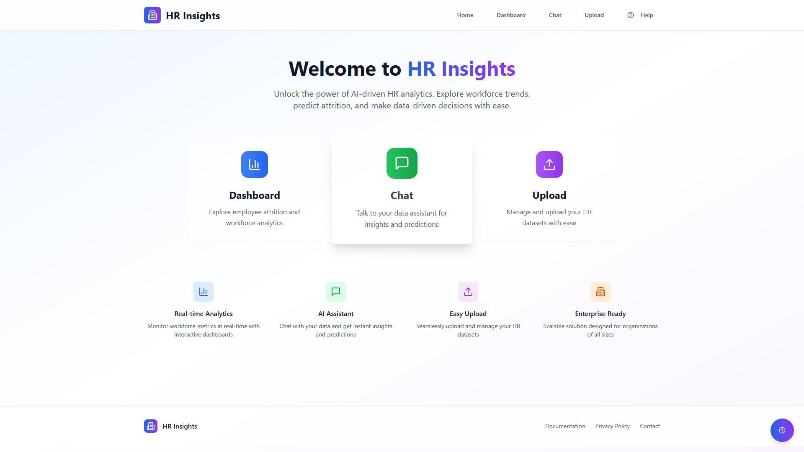
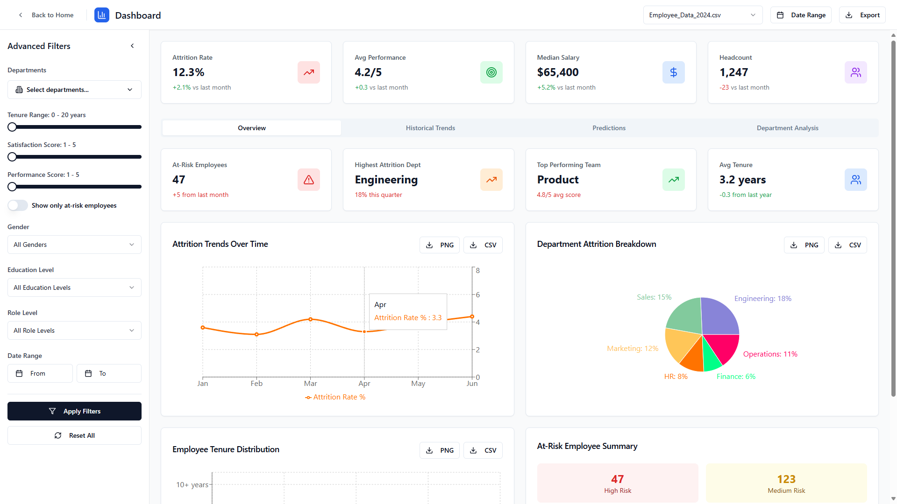
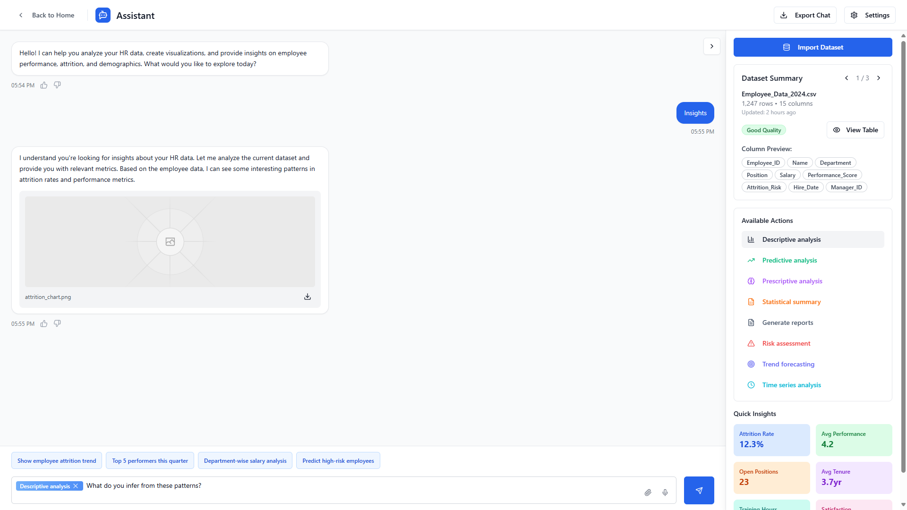
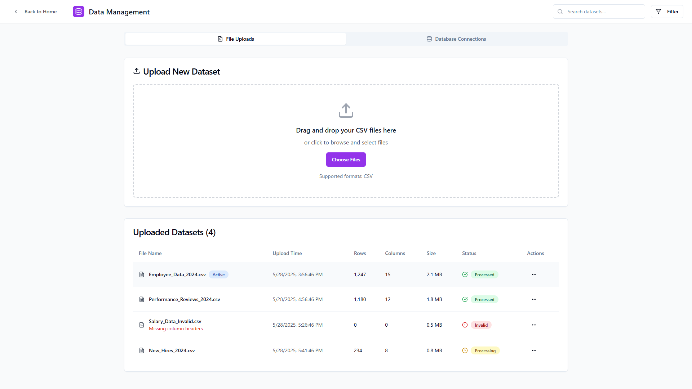

# HR Attrition Analytics Frontend

A modern, responsive frontend application for visualizing and analyzing employee attrition data with interactive dashboards and an AI-powered assistant.

## Tech Stack

This project leverages modern web technologies:

- **Vite**: Fast development server and optimized build tool
- **TypeScript**: Type-safe JavaScript for improved developer experience
- **React**: Component-based UI library
- **shadcn/ui**: Accessible and customizable component library
- **Tailwind CSS**: Utility-first CSS framework
- **Chart.js**: Interactive data visualization charts
- **React Router**: Client-side routing
- **Axios**: HTTP client for API communication
- **React Query**: Data fetching and state management

## Features

- **Interactive Dashboards**: Visualize HR attrition data across multiple dimensions
  - Age distribution
  - Gender breakdown
  - Departmental analysis
  - Education level insights
  - Job satisfaction correlation
  - Salary impact analysis
  
- **Advanced Filtering**: Segment and analyze employee data by:
  - Tenure ranges
  - Satisfaction levels
  - Performance ratings
  - Department
  - Gender
  - Education
  - Job level
  
- **AI-Powered Chat Assistant**: Natural language interface to query HR data

- **Data Management**: Upload, preview, and manage HR datasets

- **Responsive Design**: Optimized for both desktop and mobile views

## Installation

### Prerequisites
- Node.js 18+ and npm (or yarn/pnpm)
- Backend API service running (see backend documentation)

### Development Setup

1. Clone the repository:
   ```sh
   git clone git@github.com:maanu-v/Attrition-Analytics.git
   # or
   git clone https://github.com/maanu-v/Attrition-Analytics/
   ```

2. Navigate to the project directory:
   ```sh
   cd attrition-frontend
   ```

3. Install dependencies:
   ```sh
   npm install
   # or
   yarn install
   # or
   pnpm install
   ```

4. Configure environment variables:
   - Create a `.env` file in the project root
   - Set the API endpoint:
     ```
     VITE_API_URL=http://localhost:8000/api
     ```

5. Start the development server:
   ```sh
   npm run dev
   # or
   yarn dev
   # or
   pnpm dev
   ```

6. Open your browser and navigate to `http://localhost:5173`

### Production Build

Create an optimized production build:
```sh
npm run build
# or
yarn build
# or
pnpm build
```

Preview the production build locally:
```sh
npm run preview
# or
yarn preview
# or
pnpm preview
```

## Project Structure

```
attrition-frontend/
├── public/             # Static assets
├── src/
│   ├── assets/         # Images, fonts, and other static assets
│   ├── components/     # Reusable UI components
│   │   ├── charts/     # Chart components
│   │   ├── dashboard/  # Dashboard-specific components
│   │   ├── layout/     # Layout components (header, sidebar)
│   │   └── ui/         # shadcn/ui components
│   ├── context/        # React context providers
│   ├── hooks/          # Custom React hooks
│   ├── lib/            # Utility functions and helpers
│   ├── pages/          # Page components
│   ├── services/       # API service functions
│   ├── types/          # TypeScript type definitions
│   ├── App.tsx         # Root component
│   ├── main.tsx        # Application entry point
│   └── routes.tsx      # Route definitions
├── .env                # Environment variables
├── index.html          # HTML entry point
├── package.json        # Project dependencies and scripts
├── tailwind.config.js  # Tailwind CSS configuration
├── tsconfig.json       # TypeScript configuration
└── vite.config.ts      # Vite configuration
```

## Usage

### Authentication

The application requires authentication to access protected routes. Log in with credentials provided by your administrator or use the demo account if available.

### Navigation

- **Dashboard**: Main analytics overview with key metrics
- **Insights**: Detailed breakdown of attrition factors
- **Chat Assistant**: AI-powered interface for data inquiries
- **Data Management**: Upload and manage HR datasets
- **Settings**: Configure application settings and preferences

### Visualization Controls

Each dashboard chart includes:
- **Filter Controls**: Adjust parameters to refine the data view
- **Download Options**: Export visualizations as PNG, CSV, or PDF
- **Time Range Selector**: View data from different time periods
- **Drill-down Capability**: Click on chart elements for detailed analysis

## Customization

### Theme

The application supports light and dark themes, configurable in the settings panel or automatically based on system preferences.

### Dashboard Layout

Rearrange dashboard widgets by dragging and dropping to create a personalized view of the most relevant metrics.

## API Integration

The frontend communicates with the backend API defined in the environment variables. See the backend documentation for available endpoints and data formats.

## Preview Screenshots

### Landing Page

---

### Dashboard

---

### Chat Assistant

---

### Upload and Data Management

---

## Contributing

1. Fork the repository
2. Create a feature branch: `git checkout -b feature/my-feature`
3. Commit changes: `git commit -m 'Add some feature'`
4. Push to the branch: `git push origin feature/my-feature`
5. Submit a pull request

## License

This project is licensed under the MIT License - see the LICENSE file for details.

## Acknowledgments

- HR data visualization best practices from [SHRM](https://www.shrm.org/)
- Design inspiration from [Refactoring UI](https://www.refactoringui.com/)
- Chart design principles from [Information is Beautiful](https://informationisbeautiful.net/)
